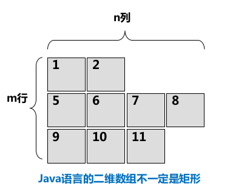

# Thinking in Java

## 第1章 对象导论

Java是一门面向对象（OOP）的编程语言

当正在试图开发或理解一个程序设计时，最好的方法之一就是将对象想象为“服务提供者”，每个对象都可以很好地完成一项任务，但是它并不试图做更多的事。在设计过程中，这有助于提高对象的内聚性；在其他人试图理解你的代码或重用某个对象时，如果他们看出了这个对象所能提供的服务的价值，它会使调整对象以适应其设计的过程变得简单很多。

访问控制的第一个存在原因是让客户端程序员无法触及他们不应该触及的部分——这些部分对数据类型的内部操作来说是必需的，但并不是用户解决特定问题所需的接口的一部分。

访问控制的第二个存在原因是允许库设计者可以改变类内部的工作方式而不用担心会影响到客户端程序员。

Java用三个关键字在类的内部设定边界：public、private、protected

public表示紧随其后的元素对任何人都是可用的

private这个关键字表示除类型创建者和类型的内部方法之外的任何人都不能访问

protected关键字与private作用相当，差别仅在于继承的类可以访问protected成员，但是不能访问private成员

当没有使用前面任何访问指定词时，将使用默认访问权限，通常称为包访问权限，在这种权限下，类可以访问在同一个包中其他类的成员，但是在包之外，这些成员如同指定了private一样。

## 第2章 一切都是对象

### 创建对象

new对象时会自动在堆里进行存储分配，而用new创建一个小的、简单的变量往往不是很有效，因此对于这些基本数据类型，Java采取与C和C++相同的方法，也就是说，不用new来创建变量，而是创建一个并非是引用的“自动”变量，这个变量直接存储“值”，并置于堆栈中，因此更加高效。

Java中所有的数值类型都有正负号，所以不要去寻找无符号的数值类型。

基本类型具有包装器类，使得可以在堆中创建一个非基本对象，用来表示对应的基本类型。

例如:

char c = 'x';

Character ch = new Character(c);	也可以用Character ch = new Character('x');

Java SE5以上可以使用自动包装功能：Character ch = 'x';

基本成员默认值

| 基本类型 | 默认值   |
| -------- | -------- |
| boolean  | false    |
| char     | null     |
| byte     | (byte)0  |
| short    | (short)0 |
| int      | 0        |
| long     | 0L       |
| float    | 0.0F     |
| double   | 0.0D     |

若类的**某个成员**是基本数据类型，即使没有进行初始化，Java也会确保它获得一个默认值。

上述确保初始化的方法并不适用于局部变量（即并非某个类的字段），在某个方法定义中有```int x;```那么变量x得到的是任意值，而不会被自动初始化为零。

### 对象的作用域

以下代码在C和C++中是合法的，但是在Java中却不能这样书写（在C和C++里将一个较大的作用域的变量隐藏起来的做法，在Java里是不允许的）：

```java
{
    int x = 12;
    {
        int x = 96;
    }
}
```

Java对象不具备和基本类型一样的生命周期，当用new创建一个Java对象时，这个new出来的Java对象可以存活于作用域之外，所以假如你采用代码

```java
{
    String s = new String("a string");
}
```

变量的作用域：出了大括号没人认识

引用s在作用域终点就消失了 ，然而s指向的String对象仍然继续占据内存空间，只是在这一小段代码中，我们无法在这个作用域之后再访问这个对象，因为对它唯一的引用已超出了作用域的范围。事实上，new出来的对象，只要你需要，就会一直保留下去。Java有垃圾回收器，用来监视用new创建的所有对象，并辨别那些不会再被引用的对象，随后释放这些对象的内存空间，以便供其他新的对象使用。

如果只想为某特定域分配单一存储空间，而不去考虑究竟要创建多少对象，甚至根本就不创建任何对象；另一种情形是希望某个方法不与包含它的那个类的任何对象关联在一起。也就是说，即使没有创建对象，也能够调用这个方法——static关键字

使用类名是引用static变量的首选方式，这不仅是因为它强调了变量的static结构，而且在某些情况下它还为编译器进行优化提供了更好的机会.

和其他任何方法一样，static方法可以创建或使用与其类型相同的被命名对象，因此，static方法常常拿来做牧羊人的角色，负责看护与其隶属同一类型的实例群。

### Java程序基础

java.lang是默认导入到每一个Java文件中的，所以它的所有类都可以被直接使用。

```System.out.println();```out是一个System的静态PrintStream对象，所以可以直接用类名调用它。

### javadoc

共有三种类型的注释文档，分别对应于注释位置后面的三种元素：类、域和方法。也就是说，类注释正好位于类定义之前，域注释正好位于域定义之前，而方法注释也正好位于方法定义的前面。

```java
/** A class comment */
public class Documentaion1 {
    /** A field Comment */
    public int i;
    
    /** A method Comment */
    public void f() {}
}
```

javadoc可以嵌入HTML标签，对普通文本按照你自己所描述的进行格式化。但注意不要在嵌入式HTML中使用标题标签，例如```<h1>```或```<hr>```，因为javadoc会插入自己的标题，而你的标题可能同他们发生冲突。

一些标签示例：

1. @see

11. @deprecated

## 第4章 控制执行流程

### 基本控制执行流程

if-else while do-while for forEach break continue reutrn switch

虽然在C和C++中是允许的，但是Java不允许我们将一个数字作为布尔值使用，如果想在布尔测试中使用一个非布尔值，比如在if(a)中，那么首先必须使用一个条件表达式将其转换成布尔值，例如if(a!=0)

else if并非一个新的关键字，那仅仅只是一个else后面紧跟了另一个新的if语句

```java
for(char c = 0; c < 128; c++) {
    if(Character.isLowerCase(c)) {
        System.out.println("value: " +
                (int)c + " character:" + c);
    }
}
```

这里用了static的isLowerCase()方法来检查一个字符是否为小写字母

value: 97 character:a
value: 98 character:b
value: 99 character:c
value: 100 character:d
value: 101 character:e
……………………

使用break、continue、return语句控制流程

无穷循环的两种写法：while(true)和for(;;)

Switch-Case语句是实现多路选择的一种干净利落的方式，但是它允许使用的选择因子只能是整型（byte，short，char，int），你无法将一个浮点数作为选择因子使用，这种限制可以通过使用枚举类型ENUM来减弱，因为enum可以与switch配合使用。

注：Java1.7的新特性有一点是switch case语句中可以使用字符串作为选择因子了，如：

```java
Scanner scanner = new Scanner(System.in);
String a = scanner.nextLine();
switch (a) {
    case "AAA":
        System.out.println("ONE");break;
    case "B":
        System.out.println("TWO");break;
    default:
        System.out.println("DEFAULT");break;
}
```

### Foreach语法

JavaSE5引入了一种新的更加简介的for语法用于数组和容器，即Foreach语法，表示不必创建变量去对由访问项构成的序列进行计数，foreach将自动产生每一项。

例如：

```java
Random random = new Random(79);
float f[] = new float[10];
for(int i = 0; i < 10; i++) {
    f[i] = random.nextFloat();
}
for(float x : f) {
    System.out.println(x);
}
```

```java
for(char c : "It's a happy day".toCharArray()) {
    System.out.print(c + " ");
}
```

可见，任何返回一个数组的方法都可以使用Foreach，另外，Foreach还可以用于Iterable对象。涉及到容器时再做探讨。

注：System.out.println是自带换行的输出，System.out.print是不自带换行的输出。

当然，对于```for(int i = 0; i < 10; i++)```这种语句，foreach语法就无能为力了（除非你先创建一个int数组……）

总的来说，foreach语法不仅在录入代码时节省时间，更重要的是，它阅读起来也要容易的多，他更倾向于说明我们在做的工作是什么（例如获取数组中的每一个元素），而不是给出我们正在做的这项工作的细节（例如创建索引，然后用这个索引来获取数组中的每一个元素）。

### break label，continue label

规则：

①一般的continue方法会退回最内层循环的开头，并继续执行

②带标签的continue会到达标签的位置，并重新进入紧接在那个标签后面的循环

③一般的break会中断并跳出当前循环

④带标签的break会中断并跳出标签所指的循环

注意：Java里需要使用标签的唯一理由是因为有循环嵌套存在，而且想从多层嵌套中break或continue

```java
int i = 0;
outer:
for(i = 0;; System.out.println("test")) {
    inner:
    for(; i < 10; i++) {
        System.out.println("i = "+i);
        if(i == 2) {
            System.out.println("continue");
            continue;
        }
        if(i == 3) {
            System.out.println("break");
            i++;
            break;
        }
        if(i == 7) {
            System.out.println("continue outer");
            i++;
            continue outer;
        }
        if(i == 8) {
            System.out.println("break outer");
            break outer;
        }
        System.out.println("OK");
    }
}
```

输出结果如下：

i = 0
OK
i = 1
OK
i = 2
continue
i = 3
break
test
i = 4
OK
i = 5
OK
i = 6
OK
i = 7
continue outer
test
i = 8
break outer

可见，break会中断for循环，而且在未抵达for循环的末尾之前，因此，递增表达式不会执行。

continue outer会跳到循环顶部，而且也会跳过内循环的递增表达式，会触发外循环的递增表达式。

## 第5章 初始化与清理

涉及基本类型的重载

finalize

方法的局部变量如果没有得到恰当的初始化，Java会提出编译时错误；而类的每个基本类型数据成员保证都会有一个初始值，类里定义的对象引用如果不将其初始化，此引用会获得一个null

## 第11章 持有对象

数组是保存一组对象的最有效的方式，如果你想保存一组基本数据类型，也推荐使用这种方式，但是数组具有固定的尺寸，而在更一般的情况中，你在写程序时并不知道需要多少个对象，或者是否需要更复杂的方式来存储对象，因此数组尺寸固定这一限制显得过于受限了。Java类库提供了一套相当完整的容器类来解决这一问题，其中基本的类型是List、Set、Queue、Map，这些对象类型也称为集合类。Java容器类都可以自动地调整自己的尺寸，因此，与数组不同，在编程时你可以将任意数量的对象放置到容器中，并且不需要担心容器应该设置为多大。


## 第13章 字符串

### 13.1 不可变String

String对象是不可变的（final类），即String类不能被继承，成员方法默认都是final方法，String类其实是通过char数组来保存字符串的，String类中每一个看起来会修改String值的方法，实际上都是创建了一个全新的String对象以包含修改后的字符串内容，而最初的String对象则丝毫未动。

```java
String q = "testString";
System.out.println("q = " + q);
String qq = q.toUpperCase();
System.out.println("q = " + q);
System.out.println("qq = " + qq);
```

输出结果：

q = testString
q = testString
qq = TESTSTRING

当q调用toUpperCase()方法时，传递的是引用的一个拷贝，事实上，每当把String对象作为方法的参数时，都会复制一份引用，而该引用所指的对象其实一直待在单一的物理位置上，从未动过。

String对象是不可变的，你可以给一个String对象加任意多的别名，因为String对象具有“只读”特性，所以指向它的任何引用都不可能改变它的值，因此，也就不会对其他的引用有什么影响。

王晓东：String对象一旦被创建就是固定不变的，对String对象的任何操作都不影响到原对象，而是会生成新的对象。

### 13.2 String与StringBuilder

设有以下代码

```String s = "abc" + "mango" + "def" + 47;```

这段代码是这样工作的：虽然我们在源代码中没有使用StringBuilder类，但是编译器自作主张地使用了它，因为它更加高效，在这个例子中，编译器创建了一个StringBuilder对象，用以构造最终的String，并为每个字符串调用了一次StringBuilder的append()方法，总计四次，最后调用StringBuilder的toString()方法生成结果，并存为s。

现在，也许你会觉得可以随意使用String对象和“+”操作符，反正编译器会自动为你优化性能，但是其实不然，思考以下例子：

```java
String[] fields = new String[] {"abc", "def", "mango", "1999"};
String result = "";
for(int i = 0; i < fields.length; i++) {
    result += fields[i];
}
```

```java
String[] fields = new String[] {"abc", "def", "mango", "1999"};
StringBuilder builder = new StringBuilder();
for(int i = 0; i < fields.length; i++) {
    builder.append(fields[i]);
}
String result = builder.toString();
```

在第一段代码中，编译器会在循环之中构造StringBuilder，也就是说，每经过一次循环，就会创建一个新的StringBuilder对象。而在第二段代码中，一共只有一个StringBuilder对象。

因此，当你为一个类编写toString()方法时，如果字符串操作比较简单，那就可以信赖编译器，因为它会合理地构造最终的字符串结果，但是如果你要在toString()方法中使用循环，那么最好自己创建一个StringBuilder对象，用它来构建最终的结果。

注：如果你写了builder.append("1999" + "7" + "9")，那么编译器会为你另外创建一个StringBuilder对象来处理括号内的字符串操作。

StringBuilder提供了insert() replace() substring() reverse() append() toString() delete()方法等

### 13.3 String上的操作

| 方法                   | 参数，重载版本                                               | 应用                                                         |
| ---------------------- | ------------------------------------------------------------ | ------------------------------------------------------------ |
| 构造器                 | 见例1                                                        | 创建String对象                                               |
| length()               |                                                              | String中字符的个数                                           |
| charAt()               | int索引                                                      | 取得String中该索引位置上的char                               |
| equals()               | 与之进行比较的String                                         | 比较两个String的内容是否相同                                 |
| equalsIgnoreCase()     | 与之进行比较的String                                         | 忽略大小写，比较两个String的内容是否相同，如果相同，返回true |
| compareTo()            | 与之进行比较的String                                         | 区分大小写，按词典顺序比较String的内容，比较结果为负数，0或正数 |
| trim()                 |                                                              | 将String两端的空白字符删除后，返回一个新的String对象         |
| toLowerCase()          |                                                              | 将字符串的大小写改变后，返回一个新的String对象，如果没有改变发生，则返回原始的String对象 |
| toUpperCase()          |                                                              | 同上                                                         |
| valueOf()              | Object;char[];char[]，偏移量,字符个数;boolean;char;int;long;float;double | 返回一个表示参数内容的String                                 |
| subString()            | 起始索引；起始索引+终点坐标                                  | 返回一个新的String，为参数所指定的字符串                     |
| concat()               | 要连接的String                                               | 返回一个新的String对象，内容为原始String连接上参数String     |
| replace()              | 要替换掉的字符，用来进行替换的新字符，也可以用一个charSequence来替换另一个charSequence | 返回替换字符后的新String对象，如果没有替换发生，则返回原始的String对象 |
| replaceFirst()         |                                                              |                                                              |
| replaceAll()           |                                                              |                                                              |
| getChars(), getBytes() | 要复制部分的起点和终点的索引，复制的目标数组，目标数组的起始索引 | 复制char或byte到一个目标数组中                               |
| toCharArray()          |                                                              | 生成一个char[]，包含String的所有字符                         |
| contains()             | 要搜索的charSequence                                         | 如果该String对象包含参数的内容，则返回true                   |
| contentEquals()        |                                                              |                                                              |
| startsWith()           | 可能的起始String                                             | 返回boolean结果，以表明该String是否以此参数开始              |
| endsWith()             | 该String可能的后缀String                                     | 返回boolean结果，以表名此参数是否是该String的后缀            |
| indexOf()              |                                                              | 如果该String并不包含此参数，就返回-1，否则返回此参数在String中的起始索引 |
| lastIndexOf()          |                                                              | 同上，只不过是从后向前搜索                                   |
| intern()               |                                                              | 为每个唯一的字符序列生成一个且仅生成一个String引用           |
| regionMatcher()        | 该String的索引偏移量，另一个String及其索引偏移量，要比较的长度。重载版本增加了忽略大小写功能 | 返回boolean结果，以表名所比较区域是否相等                    |

备注：CharSequence是一个接口，它只包括length(), charAt(int index), subSequence(int start, int end)这几个API接口。除了String实现了CharSequence之外，StringBuffer和StringBuilder也实现了CharSequence接口。

例1：字符串变量的创建

格式 1
```java
String s;// 声明字符串型引用变量 s , 时 s 的值为 null
s = new String("Hello"); // 在堆内存中分配空间,并将 s 指向该字符串
```
格式 2 
```java
String s = new String("Hello");
```
格式 3 
```java
String s = "Hello";
```
例2：求字符串长度

```java
int strlength = str.length(); //strlength = 7
String str = new String("asdfzxc");
```

例3：获取字符串某一位置字符

```java
char ch = str.charAt(4); //ch = z
```

例4：提取子串

```java
String str2 = str1.substring(2); //str2 = "dfzxc"
String str3 = str1.substring(2,5); //str3 = "dfz"
```

例5：字符串连接

```java
String str = "aa".concat("bb").concat("cc");
String str = "aa" + "bb" + "cc"; // 相当于上一行
```

例6：字符串比较

```java
String str1 = new String("abc");
String str2 = new String("ABC");
int a = str1.compareTo(str2); //a>0
int b = str1.compareTo(str2); //b=0
boolean c = str1.equals(str2); //c=false
boolean d = str1.equalsIgnoreCase(str2); //d=true
```

例7：字符串中字符的大小写转换

```java
String str = new String("asDF");
String str1 = str.toLowerCase(); //str1 = "asdf"
String str2 = str.toUpperCase(); //str2 = "ASDF"
```

例8：字符串中字符的替换

```java
String str = "asdzxcasd";
String str1 = str.replace('a','g'); //str1 = "gsdzxcgsd"
String str2 = str.replace("asd","fgh"); //str2 = "fghzxcfgh"
String str3 = str.replaceFirst("asd","fgh"); //str3 = "fghzxcasd"
String str4 = str.replaceAll("asd","fgh"); //str4 = "fghzxcfgh"
```

### 13.4 格式化输出（待补充）

### 13.5 正则表达式（待补充）

### 13.6 扫描输入（待补充）

由键盘获得输入

```java
import java.io.*;
public class MyClass {
    public static void main(String[] args) throws IOException {
        int num1, num2;
        String str1, str2;
        InputStreamReader in;
        in = new InputStreamReader(System.in);
        BufferedReader buf;
        buf = new BufferedReader(in);
        System.out.print("请输入第一个数:");
        str1 = buf.readLine();  // 将输入的内容赋值给字符串变量 str1
        num1 = Integer.parseInt(str1); // 将 str1 转成 int 类型后赋给 num1
        System.out.print("请输入第二个数:");
        str2 = buf.readLine();
        // 将输入的内容赋值给字符串变量 str2
        num2 = Integer.parseInt(str2); // 将 str2 转成 int 类型后赋给 num2
        System.out.println(num1 + " * " + num2 + " = " + (num1 * num2));
    }
}
```

InputStreamReader -> BufferedReader -> 读入

为了简化输入操作，JavaSE 5版本开始新增了一个Scanner类，可以使用该类输入一个对象。

```java
import java.util.*;
public class MyClass {
    public static void main(String[] args)
    {
        Scanner reader = new Scanner(System.in);
        double num;
        num = reader.nextDouble(); // 按照 double 类型读取键盘输入
        ...
    }
}
```

其他可用的读取方法还有nextByte() nextDouble() nextFloat() nextInt() nextLong() nextShort() next() nextLine()


无意识的递归

当你想要打印出一个对象的内存地址的时候，你会怎么写呢？

你可能会使用this关键字，用起来大概是这个样子的：

​```java
//Person类中的方法
public void printAddress() {
​    System.out.println(this);
}
```

​```java
Person person1 = new Person("张三",18);
Person person2 = new Person("李四", 19);
Person person3 = new Person("王五", 20);
person1.printAddress();
person2.printAddress();
person3.printAddress();
```

输出结果是这个样子的：

Person@1cd072a9
Person@7c75222b
Person@4c203ea1

Java中的每个类从根本上来说都是继承自Object的，标准容器类自然也不例外，因此容器类都有toString()方法，并且重写了该方法，使得它能生成的String结果能够表达容器自身，以及容器所包含的对象。例如ArrayList.toString()，它会遍历ArrayList中包含的所有对象，调用每个元素上的toString()方法，例如：、

```java
Person person1 = new Person("张三",18);
Person person2 = new Person("李四", 19);
Person person3 = new Person("王五", 20);
List<Person> list = new ArrayList<>();
list.add(person1);
list.add(person2);
list.add(person3);
System.out.println(list);
```

输出结果 [Person@1cd072a9, Person@7c75222b, Person@4c203ea1]

那么，当我对于Person的toString()按如下方式进行重写时，再次执行上一段代码，会发生什么问题呢？

```java
@Override
public String toString() {
    return "PersonAddress： " + this;
}
```

答：会报一个报错信息非常非常非常长的Exception（StackOverFlow）

原因：编译器看到一个String对象后面跟着一个“+”，而“+”后面的对象还不是个字符串，于是编译器就试着将this转换成一个String，那么this要怎么转换成String呢，当然是调用它的toString()方法，于是乎……发生了永无止境的递归调用，然后栈就Overflow了。

所以，如果你真的要打印对象的内存地址，你应该使用super.toString()方法。（也就是去调用Object的toString()方法）

## 第16章 数组

### 基础知识

在Java中，数组是一种效率最高的存储和随机访问对象引用序列的方式，数组是一个简单的线性序列，这使得元素访问非常快速，为此付出的代价就是数组对象的大小被固定，并且在其生命周期中不可改变。数组之所以优于泛型之前的容器，就是因为你可以创建一个数组去持有某种具体类型，这意味着你可以通过编译期检查来防止插入错误类型和抽取不当类型。当然无论在编译时还是运行时，Java都会组织你向对象发送不恰当的消息，所以说不是说哪种方法更不安全，只是……如果编译时就能把错误指出来，会减少你被运行时爆出一长串异常吓着的可能性。

数组可以持有基本类型，而泛型之前的容器不能，但是有了泛型以后，容器就可以指定并检查他们所持有的对象的类型，并且有了自动包装机制以后，容器看起来也可以持有基本类型了。可以说，随着自动包装机制的出现，容器已经可以与数组几乎一样方便地使用基本类型了。

```java
int[] integers = {0, 1, 2, 3, 4, 5};
List<Integer> intList = new ArrayList<Integer>(Arrays.asList(0, 1, 2, 3, 4, 5));
```

对象数组和基本类型数组在使用上几乎是相同的，唯一的区别就是对象数组保存的是引用，基本类型数组直接保存基本类型的值。

```java
Person[] a;
Person[] b = new Person[5];
Person[] c = new Person[4];
for(int i = 0; i < c.length; i++) {
    if(c[i] == null) {
        c[i] = new Person();
    }
}
Person[] d = {new Person(), new Person(), new Person()};
a = d;
```

数组a是一个尚未初始化的局部变量，在你对它正确地初始化之前，编译器不允许你用此引用做任何事情。

数组b初始化为一个指向Person引用的数组，但其实并没有Person置入该数组中，然而你仍然可以询问该数组的大小，因为b指向的是一个合法的对象，也就是说，length有一个问题，那就是你无法知道在数组中确切地有多少元素，length是数组的大小，只表示数组能容纳多少元素，而不是实际保存的元素个数。

新生成一个数组对象时，其中所有的引用被自动初始化为null，所以检查其中的引用是否为null，即可知道数组某个位置是否有对象。同样，基本类型的数组如果是数值型的，会被自动初始化为0，如果是布尔型的，会被自动初始化为false。

当你的方法想要返回一组值，而不是一个值的时候，在Java中，可以直接返回一个数组，而无需担心要为数组负责，你使用完后，垃圾回收器会清理掉它。

```java
int[][] a = {
    {1, 2, 3},
    {4, 5, 6}
};
int[][][] b = new int[2][3][4];
System.out.println(Arrays.deepToString(b));
```

输出结果：[[[0, 0, 0, 0], [0, 0, 0, 0], [0, 0, 0, 0]], [[0, 0, 0, 0], [0, 0, 0, 0], [0, 0, 0, 0]]]

每对花括号括起来的集合都会把你带到下一级数组。

Arrays.deepToString()方法可以将多维数组转换为多个String

```java
Person[][] array = {
    {new Person(), new Person()},
    {new Person(), new Person(), new Person(), new Person()},
    {new Person(), new Person(), new Person()}
};
```



Java语言的二维数组不一定是矩形（矩阵中的每个向量都可以具有任意的长度，这被称为粗糙数组）

自动包装机制对数组初始化也有作用：

```java
Integer[][] a = {
    {1,2,3,4,5,6,7,8,9,10},
    {11,12,13,15},
    {21,23,27}
};
```

Java中的二维数组看作是由多个一维数组组成，二维数组申请内存必须指定高层维数：

```java
int[][] array1 = new int[10][];
int[][] array2 = new int[10][4];
int[][] x;		//表示定义了一个数组引用变量 x,第一个元素为 x[0], 最后一个为 x[n-1],其长度不确定
```

可以逐个地、部分地构建一个数组：

```java
Integer[][] a;
a = new Integer[3][];
for(int i = 0; i < a.length; i++) {
    a[i] = new Integer[3];
    for(int j = 0; j < a[i].length; j++) {
        a[i][j] = i + j;			//AutoBoxing
    }
}
```

**注：声明多维数组并初始化时不能指定其长度**

### 数组与泛型（待补充）

### 用Generator创建测试数据（待补充）

### Arrays类

1. Arrays.fill()

   用同一个值填充各个位置，针对对象而言，则是复制同一个引用进行填充

   ```java
   boolean[] a1 = new boolean[6];
   int[] a2 = new int[6];
   double[] a3 = new double[6];
   String[] a4 = new String[6];
   Arrays.fill(a1, false);
   Arrays.fill(a2, 11);
   Arrays.fill(a3, 0.7);
   Arrays.fill(a4, "Hello");
   Arrays.fill(a4, 3, 5, "World");
   System.out.println(Arrays.toString(a1));
   System.out.println(Arrays.toString(a2));
   System.out.println(Arrays.toString(a3));
   System.out.println(Arrays.toString(a4));
   ```

   输出结果：
   ```
   [false, false, false, false, false, false]
   [11, 11, 11, 11, 11, 11]
   [0.7, 0.7, 0.7, 0.7, 0.7, 0.7]
   [Hello, Hello, Hello, World, World, Hello]
   ```

   使用Arrays.fill()可以填充整个数组，或者只填充数组的某个区域

   注：填充数组的某个区域时index从0开始数，是左闭右开区间

2. 复制数组

   Java标准类库提供了一个static方法System.arraycopy()，用它复制数组要比用for循环复制快很多。

   ```java
   int[] i = new int[7];
   int[] j = new int[10];
   Arrays.fill(i, 47);
   Arrays.fill(j, 99);
   System.out.println(Arrays.toString(i));
   System.out.println(Arrays.toString(j));
   System.arraycopy(i, 0, j, 0, i.length);
   System.out.println(Arrays.toString(j));
   输出结果：
   [47,47,47,47,47,47,47]
   [99,99,99,99,99,99,99,99,99,99]
   [47,47,47,47,47,47,47,99,99,99]
   ```

   arraycopy()需要的参数有：源数组，从源数组中的什么位置开始复制的偏移量，目标数组，从目标数组的什么位置开始复制的偏移量，需要复制的元素个数。

   注：对数组的任何越界操作都会导致异常。

   注：基本类型数组和对象数组都可以复制，然而，如果复制对象数组，那么只是复制了对象的引用，而不是对象本身的拷贝，即**浅复制**。

   关于浅复制和深复制？？？

   注：System.arraycopy()不会执行自动包装和自动拆包，两个数组必须具有相同的确切类型。

3. 数组的比较

   Arrays类提供了重载过的equals()方法来比较整个数组。数组相等的条件是元素个数必须相等，并且对应位置的元素也要相等，这可以通过对每一个元素使用equals()方法来作比较（对于基本类型，需要使用基本类型的包装器类的equals()方法，例如对于int类使用Integer.equals()方法作比较）

   ```java
   String[] s1 = new String[4];
   Arrays.fill(s1, "Hi");
   String[] s2 = {new String("Hi"), new String("Hi"), new String("Hi"), new String("Hi")};
   System.out.println(Arrays.equals(s1, s2));
   ```

   输出结果：true

4. 数组元素的比较

   方式1：

   实现java.lang.Comparable接口，使你的类具有“天生”的比较能力，实现这个接口只需要实现一个compareTo()方法，此方法接收另一个对象作为参数，如果当前对象小于参数则返回负值，如果相等返回0，如果当前对象大于参数对象则返回正值。

   ```java
   public class Grade implements Comparable<Grade>{
       private int score;
       
       public int compareTo(Grade other) {
           return (score < other.score ? -1 (score == other.score ? 0 : 1));
       }
   }
   ```

   ```java
   Grade[] a = new Grade[10];
   ………………
   Arrays.sort(a);
   ```

   上例的输出结果为从小到大排序

   Collections类包含一个reverseOrder()方法，该方法可以产生一个Comparator，它可以反转自然的排序顺序（下例为从大到小排序）

    ```java
    Arrays.sort(a, Collections.reverseOrder());
    ```
   方式2：

   编写自己的Comparator

   ```java
   class MyComprator implements Comparator {
           public int compare(Object arg0, Object arg1) {
               CoinEntity t1 = (CoinEntity) arg0;
               CoinEntity t2 = (CoinEntity) arg1;
               if(t1.getCoin() != t2.getCoin())
                   return t1.getCoin()>t2.getCoin()? -1:1;
               else
                   return 0;
           }
       }
   ```

   ```java
   Arrays.sort(a, new MyComparator());
   ```

5. 数组排序

   ```java
   String[] sa = new String[20];
   ……………………
   System.out.println(Arrays.toString(sa));
   Arrays.sort(sa);
   System.out.println(Arrays.toString(sa));
   Arrays.sort(sa, Collections.reverseOrder());
   System.out.println(Arrays.toString(sa));
   Arrays.sort(sa, String.CASE_INSENSITIVE_ORDER)；
   System.out.println(Arrays.toString(sa));
   ```
```

   输出结果如下：

   ```java
   Before Sort:
   [YNzbr, nyGcF, OWZnt, cQrGs, eGZMm, JMRoE, suEcU, OneOE, dLsmw, HLGEa, hKcxr, EqUCB, bkIna, Mesbt]
   After Sort:
   [EqUCB, HLGEa, JMRoE, Mesbt, OWZnt, OneOE, YNzbr, bkIna, cQrGs, dLsmw, eGZMm, hKcxr, nyGcF, suEcU]
   Reverse sort:
   [suEcU, nyGcF, hKcxr, eGZMm, dLsmw, cQrGs, bkIna, YNzbr, OneOE, OWZnt, Mesbt, JMRoE, HLGEa, EqUCB]
   Case-insensitive Sort:
   [bkIna, cQrGs, dLsmw, eGZMm, EqUCB, hKcxr, HLGEa, JMRoE, Mesbt, nyGcF, OneOE, OWZnt, suEcU, YNzbr]
```

   可以对任意的基本类型数组排序，也可以对任意的对象数组进行排序，只要该对象实现了Comparable接口或具有相关联的Comparator。

   String排序算法依据**词典编排顺序**排序，所以大写字母开头的词都在前面，然后才是小写字母开头的词

   (陈玉沅：所谓词典编排顺序，就是按照ASCII码排序的……）

6. 在已排序的数组中查找

   如果数组已经排好序了，就可以使用Arrays.binarySearch()执行快速查找。如果要对未排序的数组使用binarySearch()，那么将产生不可预料的结果。

   ```java
   int[] a = new int[25];
   ……………………
   Arrays.sort(a);
   int r = 322;
   int location = Arrays.binarySearch(a, r);
   ```

   如果找到了返回值，Arrays.binarySearch()产生的返回值大于等于0，否则，它产生负返回值

   如果使用Comparator排序了某个对象数组，在使用binarySearch()时必须提供同样的Comparator

   ```java
   String[] sa = new String[50];
   ………………
   Arrays.sort(sa, String.CASE_INSENSITIVE_ORDER)；
   int location = Arrays.binarySearch(sa, sa[10], String.CASE_INSENSITIVE_ORDER)；
   ```


### 总结

我们肯定还会使用数组，并且在读代码的时候还会看到它，但是，容器几乎总是更好的选择。