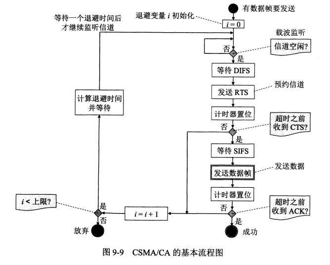

# 计算机网络

## 第九章 无线网络和移动网络

### 9.1 无线局域网WLAN

#### 一些基本概念

无线局域网 Wireless Local Area Network WLAN

便携站(portable station)和移动站(mobile station)

凡使用802.11系列协议的局域网又称为Wi-fi（Wireless-Fidelity）

802.11标准规定无线局域网的最小构件是基本服务集BSS （Basic Service Set），一个基本服务集BSS包括一个基站和若干个移动站，所有的站在本BSS内都可以直接通信，但在和本BSS以外的站通信时都必须通过本BSS的基站。接入点AP （Access Point），在MAC层使用CSMA/CA协议，就是基本服务集内的基站（Base Station），当网络管理员安装AP时，必须为该AP分配一个不超过32字节的服务集标识符SSID（Service Set IDentifier）和一个通信信道。SSID就是使用该AP的无线局域网的名字。一个基本服务集BSS所覆盖的地理范围叫做一个基本服务区BSA（Base Service Area）

一个基本服务集可以是孤立的，也可以通过接入点AP连接到一个分配系统DS（Distribution System），然后再连接到另外一个基本服务集，这样就构成了一个扩展的服务集ESS（Extended Service Set）

一个移动站若要加入到一个基本服务集BSS，就必须先选择一个接入点AP，并与此接入点建立关联（Association），建立关联就表示这个移动站加入了选定的AP所属的子网，并和这个接入点AP之间创建了一个虚拟线路，只有关联的AP才向这个移动站发送数据帧，而这个移动站也只有通过关联的AP才能向其他站点发送数据帧。移动站只能在多个AP中选择一个建立关联，通常可以选择信号最强的一个AP，但有时也可能该AP提供的信道都已被其他移动站使用了，在这种情况下，也只能与信号强度稍差些的AP建立关联。在关联阶段过后，移动站点要通过关联的AP向该子网发送DHCP发现报文以获取IP地址，这时，互联网中的其他部分就把这个移动站当做该AP子网内的一台主机。

若移动站使用重建关联（reassociation），就可把这种关联转移到另一个接入点，当使用分离（disassociation）服务时，就可终止这种关联。

**移动端与接入点AP建立关联的方法有两种。一种是被动扫描，即移动站等待接收接入点AP周期性发出的（例如每秒10次或100次）信标帧（beacon frame）。信标帧中包含有若干系统参数（如服务集标识符SSID以及支持的速率等）。另一种是主动扫描，即移动站主动发出探测请求帧（probe request frame），然后等待从接入点发回的探测响应帧（probe response frame）**

热点（hot spot）热区（hot zone）无线互联网服务提供者WISP（Wireless Internet Service Provider）

WEP（Wired Equivalent Pricacy）加密方案  WPA（WiFi Protected Access） WPA2（802.11强制执行）

移动自组网络：当移动站A和E通信时，经过A->B, B->C, C->D, D->E这样一连串的存储转发过程，因此，在从源节点A到目的节点E的路径中，移动站B，C和D都是转发节点，这些节点都具有路由器的功能。

无线传感器网络WSN（Wireless Sensor Network）是移动自组网络中的一个子集，主要应用领域是各种物联网（IoT， Internet of Things）

固定接入(fixed access)：在作为网络用户期间，用户设置的地理位置保持不变。

移动接入(mobility access)：用户设备能够以车辆速度移动时进行网络通信，当发生切换（即用户移动到不同蜂窝小区）时，通信仍然是连续的。

便携接入(portable access)：在受限的网络覆盖面积中，用户设备能够在以步行速度移动时进行网络通信，提供有限的切换能力。

游牧接入(nomadic access)：用户设备的地理位置至少在进行网络通信时保持不变。如果用户设备移动了位置（改变了蜂窝小区），那么再次进行通信时可能还要寻找最佳的基站。

***

#### 802.11局域网的MAC协议

##### CSMA/CA协议

+ 在无线局域网中，在发送数据之前先对媒体进行载波监听，如发现有其他站在发送数据，就推迟发送以免发生碰撞，但是有线连接的局域网中的CSMA/CD协议中的CD不再适用（无线局域网不需要进行碰撞检测）
  + 隐蔽站问题(hidden station problem)
  + 暴露站问题(exposed station problem)
  + 检测错误：检测到信道忙，其实不忙（暴露站问题）；检测到信道空闲，其实不空闲（隐蔽站问题）
  + 由于只要开始发送数据，就不能中途停止发送，而一定要把整个帧发送完，因此无线局域网不能使用碰撞检测，因此无线局域网应该尽量减少碰撞的发生

+ CSMA/CA协议，CA表示collision avoidance，设计是为了尽量减少碰撞发生的概率

+ 802.11局域网同时还使用了停止等待协议，无线站点每通过无线局域网发送完一帧，要等到收到对方的确认帧后才能继续发送下一帧，这是链路层确认

+ 802.11标准设计了独特的MAC层，通过协调功能（Coordinate Function）来确定在基本服务集BSS中的移动站在什么时间能够发送或接收数据，MAC层在PHY层的上面，它包括两个子层

  + 分布协调功能DCF（Distributed Coordination Function）：让各个站通过争用信道来获取发送权，802.11协议规定所有的实现必须有DCF功能
  + 点协调功能PCF（Point Coordination Function）：选项，用接入点AP集中控制整个BSS内的活动，因此自组网络没有PCF子层，用类似于探询的方法把发送数据权轮流交给各个站，从而避免了碰撞的产生。对于时间敏感的业务，就应使用提供无争用服务的点协调功能。

+ 为了尽量避免碰撞，802.11规定，所有的站在完成发送后，必须等待一段很短的时间（继续监听）才能发送下一帧，这段时间称为帧间间隔IFS（InterFrame Space）

  + SIFS：短（Short）帧间间隔，长度为28μs，是最短的帧间间隔，用来分隔开属于一次对话的各帧，使用SIFS的帧类型有ACK帧、CTS帧、由过长的MAC帧分片后的数据帧，以及所有回答AP探询的帧和在PCF方式中接入点AP发送出的任何帧。

  + DIFS：分布协调功能帧间间隔，长度为128μs，在DCF方式中，DIFS用来发送数据帧和管理帧

+ **CSMA/CA协议的工作原理**

  + 一个站如果想要发送数据，那么它先要检测信道，在物理层的空中接口进行物理层的载波监听，通过收到的相对信号强度是否超过阈值来判断是否有其他的移动站在占用信道发送数据，当源站发送它的第一个MAC帧时，如果检测到信道空闲，则在等待一个DIFS之后可以发送（再等待一个DIFS的原因是有可能其他的站由更高的优先级的帧要发送，要是真有，就正好让那个更高优先级的帧先去发送）
  + 接下来我们假定没有更高优先级的帧要发送了，那么源站就会发送自己的数据帧，目的站如果正确收到了数据帧，那么经过时间间隔SIFS之后，向源站发送确认帧ACK，若源站在规定时间内没有收到ACK帧，就重传此帧，直到收到确认为止，或者经过若干次的重传失败后放弃发送。（所以说，802.11采用的停止等待协议是一种可靠传输协议，发送方必须等待对方的确认帧）
  + 802.11还采用了虚拟载波监听（Virtual Carrier Sense）机制，让源站把它要占用信道的时间（包括目的站发回确认帧的时间）及时通知给所有其他站，这样其他站虽然没有监听信道，但是收到了一个源站的通知（MAC帧首部的第二个字段“持续时间”），也会不发送数据，效果就好像是所有站都监听了信道一样。
  + 当一个站监听到正在信道中传送的MAC帧首部的“持续时间”字段时，就调整自己的网络分配向量NAV（Network Allocation Vector），NAV指出了必须经过多长时间才能完成数据帧的这次传输，才能使信道转入到空闲状态，总的来说，一个站认为信道忙可能有两种情况，第一种可能是由于其物理层的载波监听监测到信道忙；另外一种可能是由于MAC层的虚拟载波监听机制指出了信道忙
  + 当信道从忙态变为空闲时，任何一个站要发送数据帧时，只要不是要发送的第一个帧，不仅要等待一个DIFS，而且还要进入争用窗口。换句话说，这个时候所有想要发送数据的站都要执行退避算法（802.11的退避算法是：第i次退避就在2的（2+i）次方个时隙中随机地选择一个，当时隙编号达到255时，也就是第6此退避的时候，就不再增加了，i称为退避变量），使用退避算法是一个选择争用窗口中的一个时隙的过程
  + 选择好时隙之后，根据该时隙的位置设置一个退避计时器（backoff timer），当退避计时器的时间减小到零以后，就开始发送数据（如果在减小到零之前信道又转变为忙态，那么就冻结退避计时器的数值，等信道再次变为空闲之后，等待一个DIFS，继续按着刚才剩下的时间启动计时器）

  + 如果当前信道正忙，也有刚刚退避过现在正在冻结着的站，这个时候又有一个新的站想要发送数据，那么它也会执行退避算法，进入争用窗口（也就是说，这个新来的想要发送数据的站有可能比现在已经冻着的站更早地把数据发送出去）

+ > **CSMA/CA算法总结**
  >
  > 1. 若站点最初有数据要发送（而不是发送不成功再进行重传），且检测到信道空闲，在等待时间DIFS之后，就发送整个数据帧
  > 2. 否则，站点执行CSMA/CA协议的退避算法。一旦检测到信道忙，就冻结退避计时器。只要信道空闲，退避计时器就进行倒计时
  > 3. 当退避计时器时间减少到零以时（这时信道只可能是空闲的），站点就发送整个数据帧并且等待确认
  > 4. 发送站若收到确认，就知道已发送的帧被目的站正确地收到了，这时如果要发送第二帧，就要从上面的步骤2开始，执行CSMA/CA协议的退避算法，随机选定一段退避时间。

+ 当一个站要发送数据帧时，只有检测到信道是空闲的，并且这个数据帧是它想发送的第一个数据帧时，才不使用退避算法
+ 其他时候都必须使用退避算法，具体来说，以下几种情况必须使用退避算法：
  1. 在发送第一个帧之前检测到信道处于忙态
  2. 每一次的重传
  3. 每一次的成功发送后再要发送下一帧
  4. *~~第二条和第三条是什么鬼~~*

##### 对信道进行预约

+ 目的：为了更好地解决隐蔽站带来的碰撞问题

+ 具体做法：

  + A在向B发送数据帧之前，先向B发送一个短的控制帧，叫做请求发送RTS（Request To Send），它包括源地址、目标地址和这次通信（包括相应的确认帧）所需的持续时间。RTS帧中持续时间计算应该是从RTS帧发送完毕以后到B最后发送完确认ACK的时间，公式来说，就是SIFS+CTS+SIFS+数据帧+SIFS+ACK
  + 注：A在发送RTS之前，必须监听信道，若信道空闲，等待一个DIFS之后，才能发送RTS
  + 若B正确收到了RTS帧，且媒体空闲，就向A发送一个允许发送CTS（Clear To Send）的控制帧，它也包括这次通信所需的持续时间，但是是从CTS帧发送完毕后到B最后发送完确认ACK的时间，公式来说，就是SIFS+数据帧+SIFS+ACK

  + 这两个持续时间，就是A和B的网络分配向量NAV，如前所述，其他站注意到NAV之后，就不会在这段时间发送数据了
  + RTS帧20字节，CTS14字节，相比于数据帧的最长可达2346字节，很小了，因此虽然使用RTS和CTS会使得通信效率降低，但是开销也不算很大（毕竟，如果不使用RTS和CTS这两个控制帧，就更容易发生碰撞，发生一次碰撞导致整个数据帧都要重传，浪费的时间就不止这一点了……）
  + 但是，即使使用了RTS和CTS，碰撞依然可能会发生，比如说两个站A和C同时向B站发送了RTS帧，使得B不能正确收到RTS，也就不会正确地回应CTS，这样，原先发送RTS的两个站就要各自推迟一段时间（二进制指数退避）再重新发送RTS帧

##### CSMA/CA 简化流程图

注：该流程图没有考虑较为复杂的情况（如冻结剩余退避时间等）

#### 802.11局域网的MAC帧

